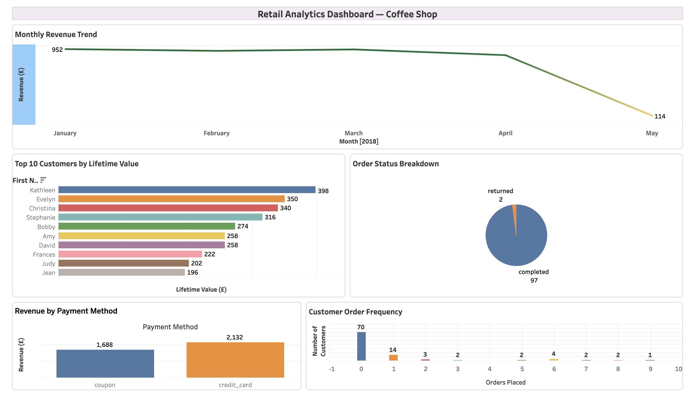

# Retail Analytics Dashboard — Coffee Shop

An interactive sales analytics dashboard built with **Tableau Public**, 
Visualising retail transaction data from a dbt + Snowflake analytics pipeline.

## Live Dashboard

[View Dashboard on Tableau Public](https://public.tableau.com/views/RetailAnalyticsDashboardCoffeeShop/RetailAnalyticsDashboardCoffeeShop)

## Dashboard Preview

## What the Dashboard Shows

Five interactive visualisations answering key business questions:

- **Monthly Revenue Trend** — How does revenue change month over month?
- **Top 10 Customers by Lifetime Value** — Who are the highest value customers?
- **Order Status Breakdown** — What proportion of orders are complete vs. returned?
- **Revenue by Payment Method** — Which payment methods drive the most revenue?
- **Customer Order Frequency** — How many orders do customers typically place?

## Data Source

Data sourced from the mart layer of the [retail-analytics-dbt](https://github.com/tessogamba/retail-analytics-dbt) project:

| Table | Description | Rows |
|-------|-------------|------|
| `fct_orders` | Order transactions with payment details | 99 |
| `dim_customers` | Customer profiles with aggregated order metrics | 100 |

Raw data modelled using dbt on Snowflake — staging and mart layers with 18 passing data quality tests.

## Key Insights

- Credit card dominates revenue at £2,132 vs coupon at £1,688
- Revenue peaked in January 2018 at £952, declining to £114 by May
- Kathleen is the highest value customer at £398 lifetime spend
- 97% order completion rate with only 2 returns
- 70 customers placed zero orders, suggesting acquisition without conversion opportunity

## Tools

Tableau Public, Microsoft Excel, SQL, dbt, Snowflake

## Related Projects

- [retail-analytics-dbt](https://github.com/tessogamba/retail-analytics-dbt) — The dbt + Snowflake pipeline that produced this data

## Author

**Teresia Ogamba a.k.a Tess Ogamba** — Data Analyst & Analytics Engineer

[LinkedIn](https://linkedin.com/in/tessogamba) | [Website](https://tessogamba.com) | [Tableau Public](https://public.tableau.com/app/profile/tessogamba)
